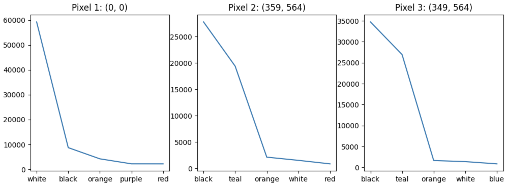

James Irwin \
CSC 369 \
02.03.2025 

### Why are the most painted pixels the most painted?
#### An analysis of r/place 2022 

*Note: reference numbers refer to code sections from accompanying [Jupyter notebook](analysis_code.ipynb), which hosts the code that is used to ground this analysis.*

To decide why the most painted pixels were the most painted, we must first determine what the most painted pixels are:1 
1. (0, 0) : 98,807 times painted
2. (359, 564) : 69,198 times painted
3. (349, 564) : 55,230 times painted

The most commonly-painted pixel (pixel 1) was at the uppermost left corner of the board. The other two pixels (pixels 2 and 3, respectively) were somewhat closer to the middle of the board and very close in proximity -- exactly 10 pixels apart in an image that was [2,000 x 2,000 pixels large](https://en.wikipedia.org/wiki/R/place#Overview). Interesting. 

At first glance, it appears that pixel 1 may have been painted so often because of its unique location. I find it strange that, out of all that 4,000,000 possible pixel locations, it is the very first one that had the most placements. Additionally, it seems that, because they were so close together, pixels 2 and 3 were painted in a related manner. To investigate these lines of reasoning, let's take a look at the top five colors that were used at each location.2 The graph below shows the number of times that each of the five most popular colors were placed for each location:

A couple of interesting observations can be made from this image. First, the color white was disproportionately used for pixel 1, accounting for roughly 60,000 of its 98,807 placements (~60.7%). Second, pixels 2 and 3 have almost the exact same color pattern, with black and teal being used almost exclusively at these locations. This evidence seems to confirm our suspicion that these two pixels are related. 

At this point, I am going to explore more deeply the apparent relationship between pixels 2 and 3. After that, I am going to return to pixel 1 and investigate why the color white was used so frequently. 

So, pixels 2 and 3. 

It appears that pixels 2 and 3 are related: not only are they very close in proximity, but they also share almost identical color usage patterns. Why could that be? Well, according to the [r/place atlas](https://2022.place-atlas.stefanocoding.me/#//383/575/4.226), the image being depicted at this location is the Jolly Roger, a symbol that represents the [Mugiwara Pirates](https://onepiece.fandom.com/wiki/Straw_Hat_Pirates), the protagonists of the popular manga *One Piece*. Furthermore, pixels 2 and 3 are located in the left and right eyes, respectively, of the Jolly Roger. Ok, interesting. But why would that warrant the use of teal? Well, this image bears resemblance to that of [Sans](https://undertale.fandom.com/wiki/Sans), a character in the role-playing game Undertale. In fact, the main distinguishing factor between the two images is that the Jolly Roger has black eyes, while Sans has teal eyes. This distinction is illustrated below: 

Jolly Roger from *One Piece*: \

Sans from Undertale: \

Thus, in order to change the image from a depiction of one character to another, users just had to place either black or teal pixels in the image's eyes. Follows of *One Piece* could place black pixels so the image would resemble the Jolly Roger, while fans of Undertale could place teal pixels in support of Sans. And this is exactly what happened. As confirmed by the r/place atlas, "Blue pixels were repeatedly placed ... to make the skull resemble Sans, a skeleton character from the video game Undertale ..." Therefore, pixels 2 and 3 were painted so often because of the battle between the fans of *One Piece* and Undertale, who frequently altered the image to represent their respective communities.

Ok, back to pixel 1.

Looking back on the graph of type of color and number of pixels placed, it is obvious that white is the most-used color. But why would that be? Well, according to the r/place atlas, that part of the board depicted the following image throughout the entirety of r/place:

Thus, it makes sense that white would be placed at pixel 1, as the coordinate (0, 0) corresponds to the white boarder that surrounds the image. However, why would users place so many white pixels? Wouldn't they just be placing white pixels on top of white pixels, effectively changing nothing? Well, I thought it was possible that pixel 1 was getting so much attention because it was the go-to placement for first-time users: users who has very little familiarity with the board and just wanted to partipate. However, only 10% of the users who placed a pixel at (0, 0) did so with their first pixel.3 So, while first-time usership may have contributed to pixel 1's usage, it was not the deciding factor. What, then, could explain the popularity of pixel 1? 

Well, my best guess is that having the current-placed pixel on (0,0) became a sort of status symbol for the members of r/place. Why would that be? Well, for reasons similar to why I thought the pixel was being frequented by first-time users: it is highly available (it doesn't take long to find coordinate (0,0)) and a part of a border that doesn't need to change. Thus, it seems plausible that maintaining "ownership" over this highly accessible pixel became a demarcator of status among the users of r/place, leading to repeated placements at this location. 

So, to summarize the findings of this analysis: 
- pixel 1, located at (0,0) had repeated placements of white pixels in attempts to gain status
- pixels 2 (359, 564) and 3 (349, 564) had repeated placements of black and teal pixels because followers of two different communites wanted the image to reflect their interests. 