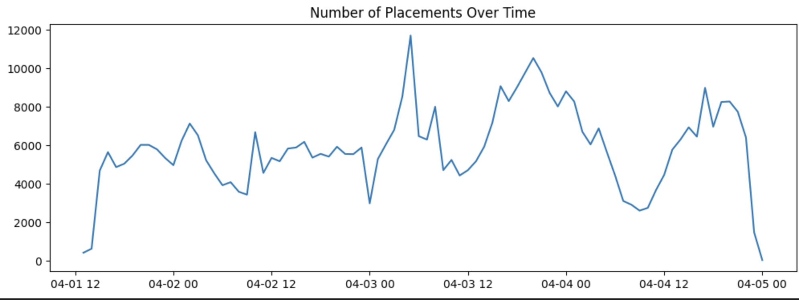
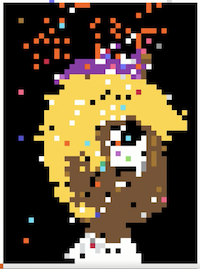
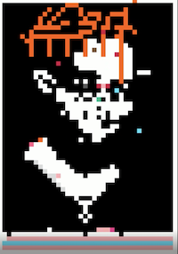

James Irwin \
CSC 369 \
02.03.2025 

### Playboi Carti and a Whole Lotta Red 
#### An analysis of r/place 2022 

*Note 1: Reference numbers refer to code sections from the accompanying [Jupyter notebook](analysis_code.ipynb), which hosts the code that is used to ground this analysis.*

*Note 2: Numerous references to outside sources contain profanity and what is generally vulgar and offensive language. Though I do not personally support the use of this language, I felt that it was necessary to include these sources to give evidence to various claims that are made in this analysis.*

#### Who is Playboi Carti? 

[Playboi Carti](https://en.wikipedia.org/wiki/Playboi_Carti) is an American rapper from Atlanta who is known for his contributions to the trap and rage music genres. Carti's most recent work is his 2020 album [*Whole Lotta Red*](https://en.wikipedia.org/wiki/Whole_Lotta_Red) (WLR). While WLR received moderate critical acclaim, it was especially celebrated by his fans, who are known for being particularly fervent and refer to themselves as "vamps." In r/place 2022, numerous vamps decided to re-create the album art from WLR with the text "Playboi Carti" underneath: 

#### Why is this worth investigating?

Well, as a fan of rap music, I am familiar with Carti's music and recognized the WLR album art fairly quickly. I thought that it would be cool to perform an analysis on something that I felt knowledgeable about, so I began to conduct research and run queries. However, I quickly realized that, much to my surprise, the WLR artwork was actually a very contentious area of the r/place board that involved streamer intervention and even an alliance! Thus, I felt compelled to dig deeper and explore the story of the WLR artwork. This analysis is a summary of my findings. 

#### Surprisingly Busy
To begin my investigation, I wanted to understand whether the WLR artwork had more activity than the rest of the board. To understand where this activity took place, I first referenced the [r/place atlas](https://2022.place-atlas.stefanocoding.me/#/8/95/491/5.681), which showed that, for almost the entire competition, the WLR artwork lived between the pixels: 
- 53, 468 (top left)
- 53, 528 (bottom left)
- 92, 528 (bottom right)
and 
- 92, 468 (top right)

With these coordinates established, I wanted to determine how many placements occurred. I discovered that the 24 most popular coordinates within the Carti plane were within the 0.05% most popular coordinates of the entire board.1 I also realized that 0.3% of total placements occurred within the scene, even though it only only occupied 0.05% of the map.2 Though these figures could be partly attributed to the fact that the scene was worked on for the entirety of r/place, I decided that they were significant enough to merit more attention.

#### Activity Over Time
My next question was about activity over time: how does the distribution of pixel placement throughout the competition look? The graph below illustrates this behavior:3

This image is interesting. Why is there a major peak around 04-03 06:00, followed by a short increase in activity? And why is there another peak around 04-03 22:00? It appears that, though there was consistent placement throughout most of the competition, there were two times at which activity increased greatly. Why could that be? 

#### The Cause of the First Peak: Adin Ross
[Adin Ross](https://en.wikipedia.org/wiki/Adin_Ross) is an American Youtuber and Twitch streamer who has become popular because of his content that features famous rappers, including [21 Savage](https://en.wikipedia.org/wiki/21_Savage), [Cordae](https://en.wikipedia.org/wiki/Cordae), and [Lil Yachty](https://en.wikipedia.org/wiki/Lil_Yachty). Typically, Adin will livestream with these rappers while they discuss music, freestyle, and just generally engage in entertaining activity. 

However, despite his apparent rapport with most rappers, Adin is known for [strongly disliking](https://www.reddit.com/r/playboicarti/comments/ro9yw8/adin_ross_and_carti_subreddit_beef/) the Reddit community that is dedicated to Playboi Carti. This is not to say that Ross dislikes Carti himself, but rather Carti's fanbase. This dislike became especially apparent during r/place. After Ross realized that Carti's supporters were re-creating the WLR album art, Ross ordered his fans to wreak havoc on it. This resulted in multiple "griefs," or instances of a streamer's fanbase destroying another community's art under the direction of the streamer. 

At first, Ross simply directed his fans to destroy the art, resulting in a generally disorganized picture, as can be seen in the following [timelapse](https://www.reddit.com/r/playboicarti/comments/ty3rfz/a_full_hq_timelapse_of_carti_on_rplace/) at 2:35. 
However, Carti's fans were able to recover and re-create the album art. In fact, they not only able to recover the art, but also taunted Ross within their own subreddit by, as described in the [r/place atlas](https://2022.place-atlas.stefanocoding.me/#/8/95/491/5.681), "posting pictures of Ross's sister Naomi's [breasts] on their sub" (these photos were originally posted by Naomi on the pornographic website OnlyFans). This retaliation enraged Ross, who proceeded to direct his fans toward another grief. This time, however, Ross decided that Carti's album art would be replaced by that of other rapper (and frequent Carti collaborator) [Lil Uzi Vert](https://en.wikipedia.org/wiki/Lil_Uzi_Vert), who had recently released the project *Lil Uzi Vert vs. the World 2*. Thus, Ross and his mods attacked the Carti imagery again, this time replacing Carti's album art with Uzi's (as can be seen in the same [timelapse](https://www.reddit.com/r/playboicarti/comments/ty3rfz/a_full_hq_timelapse_of_carti_on_rplace/) at 2:57). 

Therefore, the first peak in activity was caused by Ross and his griefing, which sent a large number of users toward a particular area to engage in a furious battle. However, despite Ross' efforts, Lil Uzi Vert himself was [unimpressed](https://www.reddit.com/r/playboicarti/comments/tw48cw/lil_uzi_telling_adin_ross_hes_rude_for_taking/) with the grief, calling Ross "rude" and imploring his sister to "get off OnlyFans."

#### The Cause of the Second Peak: Alliance

Frustrated with Ross's constant griefing, Carti's fans decided to form an alliance to prevent further attacks. Thus, the Carti community came to an [agreement with the transgender community](https://www.reddit.com/r/playboicarti/comments/tvgg7d/rtransplace_has_been_one_of_our_biggest_allys/): the transgender community would support the Carti community against attacks from Ross and others in exchange for being able to portray their flag at the bottom of the Carti imagery. Though unlikely, this alliance proved to be worthwhile, as the two communities were able to defend against further griefs and depict their respective imagery: 

Therefore, the second peak in activity comes from this alliance, as a larger number of users concentrated on a particular area to depict their respective images.

#### Conclusion

So, to summarize the findings of this analysis: 
1. The section of r/place dedicated to Playboi Carti had a lot of activity, with two major peaks across the competition.
2. The first peak of activity occurred due to an ongoing battle with the streamer Adin Ross, while the second peak occurred because of an alliance with the transgender community.

#### DuckDB vs. PySpark
Personally, I feel that I prefer DuckDB to PySpark because I was able to complete the windowing query much faster in DuckDB than in PySpark (though I acknowledge that could easily be due to my lack of ability with the latter). I also did not like that I had to convert the PySpark dataframe to a Pandas dataframe to plot with Matplotlib. However, the frameworks do not feel all that different to me because they both utilize SQL queries to generate dataframes, unlike Pandas or Polars.