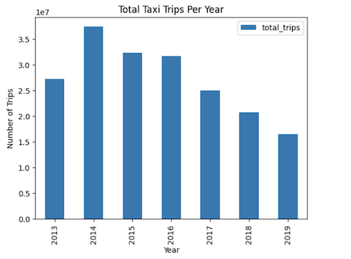
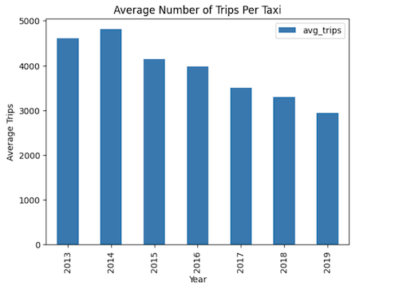
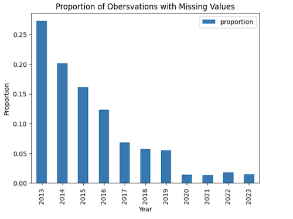
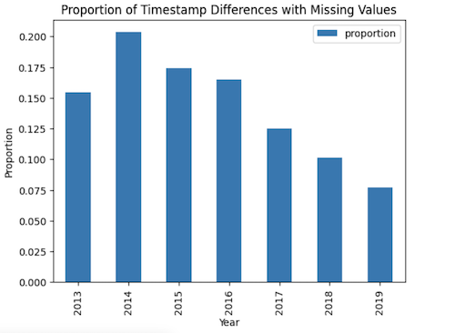
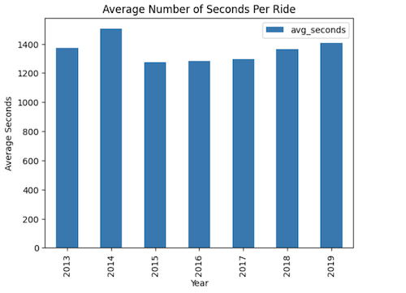
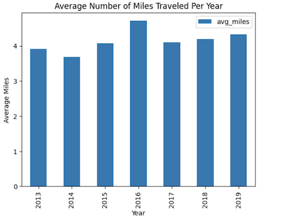

James Irwin \
CSC 369 \
03.08.2025 

### How Did the Rise of Uber Affect Taxi Usage?
#### An analysis of Chicago Taxi Data

*Note: reference numbers refer to code sections from the accompanying [Jupyter notebook](analysis_code.ipynb), which hosts the code that is used to ground this analysis.*

To answer the question of how Uber's rise impacted taxi usage, I decided to use the city of Chicago's [public dataset](https://console.cloud.google.com/marketplace/product/city-of-chicago-public-data/chicago-taxi-trips) of all taxi rides from 2013 to 2024. However, because the COVID-19 virus and its corresponding lockdowns would have such a profound influence on the data, I decided to limit the scope of my analysis to all rides that started before 2020.

After taking an initial look at the data,1 I decided that certain metrics would be important to my analysis, including: 
- total number of taxi trips per year
- average number of trips per taxi per year
- average number of seconds per trip, and 
- average number of miles per trip 

To begin, let's take a look at the total number of taxi trips per year:2

As you can see, though the number of trips increased from 2013 to 2014, there was a continued decline from 2014 to 2019. Interesting. It appears that total taxi usage declined rather significantly. Does this mean that the number of trips each taxi took also declined? Let's take a look:2

It appears so, as there is a very similar distribution between the two graphs. It seems we can conclude that, on the whole, taxi usage declined significantly between 2014 and 2019.

Interesting. Now that we have an understanding of the overall trend, we should take a look at *how* these taxis are being used. Maybe they are not only being hailed less frequently, but also for shorter durations and distances? Let's see. 

At this point in the analysis, I feel that it is appropriate to acknowledge some issues that came up in the data. More specifically, I [found that](../data_cleaning/issues.md), for the columns trip_seconds and trip_miles, a significant number of observations had values of either 0 or NULL. Moreover, these missing values are not evenly distributed across years, as shown in the following figure:3

This is an unfortunate characteristic of the data, as it makes any conclusions drawn from these variables quite shaky. Thankfully, it was possible to calculate the amount of time spent in each trip by taking the difference between the start and end timestamps. Though some of these values were still 0 or NULL, the distribution of these occurrences is a lot less skewed and looks very similar to the distribution of total trips discussed above:4

Therefore, I feel that it makes sense to use timestamp differences to evaluate how taxi usage changed over the years. Let's take a look at the average amount of times spent in each trip:5

As you can see, the average amount of time spent in each taxi ride did not change significantly throughout the years. And, even though the data is skewed and somewhat unreliable, we can also see that the same trends holds true for the average number of miles travelled:6

So what does this mean? Well, it appears that, though overall taxi usage declined significantly, the *ways* in which people used taxis didn't. Thus, while the average amount of time spent and distance travelled in each taxi ride stayed more-or-less the same, the total number of taxi rides decreased substantially. 

Now, how does Uber come into all of this? Well, this decline in taxi rides directly corresponds to Uber's growth. As [explained by Uber](https://www.uber.com/newsroom/history/), they achieved the following milestones over the same time period:
- 2014: reached 100 cities
- 2015: 1 billion trips
- 2016: 500 cities reached
- 2017: 5 billion trips 
- 2018: 10 billion trips

It is clear that Uber was experiencing incredible growth at the same time that taxi usage was declining. Purely a coincidence? Possibly. But, due to the numerous [lawsuits](https://www.theguardian.com/technology/2024/mar/18/uber-taxi-settlement-compensation-australia-272m-lawsuit) and [studies](https://www.proquest.com/docview/2130243492?accountid=10362&sourcetype=Scholarly%20Journals) that have emerged since Uber's extreme growth, I feel that it is reasonable to conclude that Uber's growth did, in fact, have a strong impact on taxi usage.
